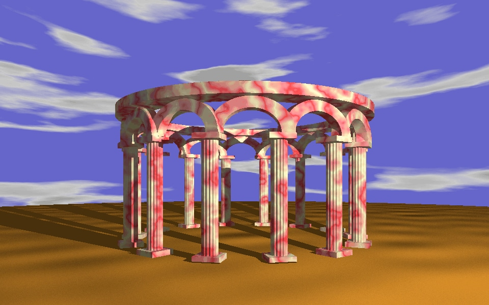

Uuencoded .bmp file appeared to be spread over several emails!
Email files are all included in the [source folder](source).



There is a description in an accompanied message:

```
This is a uuencoded bitmap.  960X600 256 colors.
The picture is a marbled gazebo on a desert with blue sky background.
The size is just right for centered wallpaper on a 1024x768 display
because it leaves a border at the bottom just big enough for icons
to fit in without being on top of the picture. Reguarding image
quality and resolution - I have not seen much better.
```
