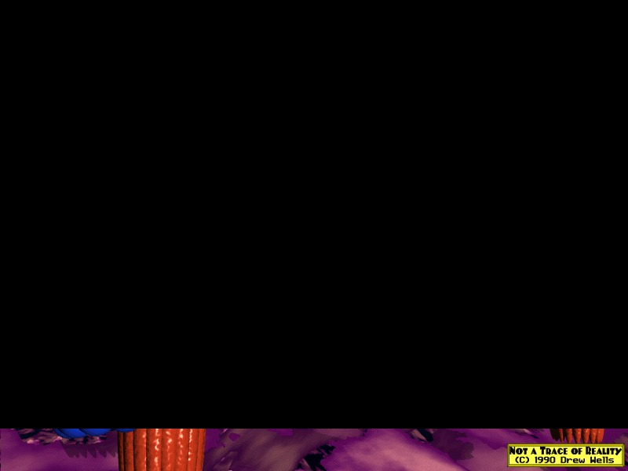
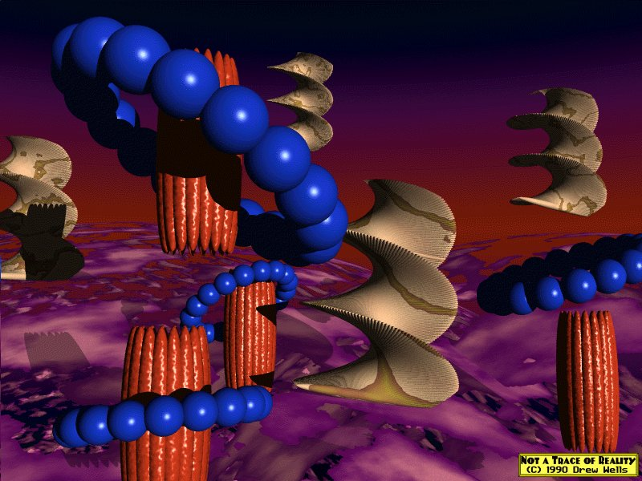

Another uuencoded .bmp image.
However, it was not possible to decode and reproduce the original image successfully: there seem to be some errors in the encoding string.

Thanks that the artist's name and the picture's one are visible, and the picture can be found on the net (eg. in this Twitter [post](https://twitter.com/GIFmodel/status/1198320150786785280)).
So, the picture was supposed to look like

